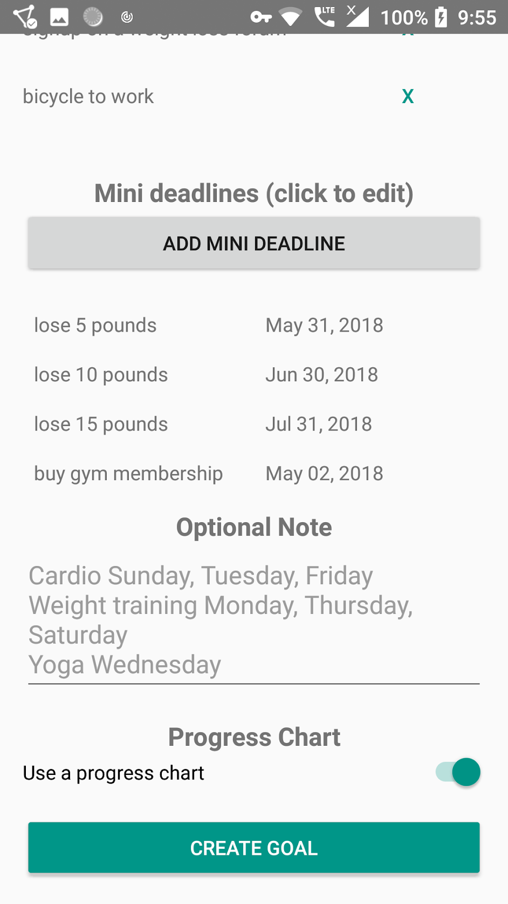

# Goal Ninja

**Note: This project has been deprecated.**

This app helps you in accomplishing your goals by combining the best techniques for it such as the tips and tricks from the TED talk ["How to Become a Millionaire in 3 Years"](https://www.youtube.com/watch?v=jvBaRf9LHDs) and the [SMART criteria](https://en.wikipedia.org/wiki/SMART_criteria). It was written using Java, Android, and [Parse](https://parseplatform.org).

# License

This project is licensed under the [MIT License](LICENSE).
